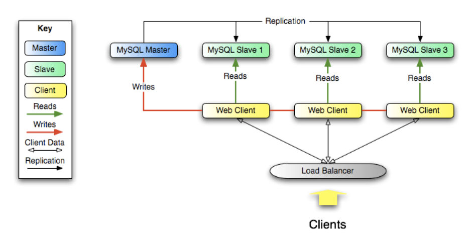

# Shard
> Definition: A piece of broken ceramic, glass, or etc.

파편. 물리적으로 다른 여러 개의 DB 서버에 데이터를 수평 분할하여 저장하는 것을 의미한다.

## 예시
20대에 대한 정보는 A DB에 저장 
30대에 대한 정보는 B DB에 저장 
 

# Replication
> Definition: An action of copying or reproducing something.

한 DB server에서 다른 DB server로 **데이터를 복사**하는 것을 의미한다. 
대용량을 처리하는 DB일 경우, master-slave 구조를 채택하는데, master에서만 데이터를 변경할 수 있고, 비동기 적으로 master -> slave로 데이터를 복사한다.

## 장점
- Scale-out solutions 
  
- 분석에 용이: slave에 쌓인 데이터로 분석하면 master의 성능에 큰 영향을 주지 않는다. 얼마든지 create 가능!
- 장거리 데이터 분산: 글로벌 서비스일 경우 매번 master에 붙는 것보다, 각 로컬의 slave DB에 붙는 것이 훨씬 효율적이다.

## 참고 링크
- [MySQL Replication](https://dev.mysql.com/doc/refman/8.0/en/replication.html)
- [MySQL using replication for scale-out](https://dev.mysql.com/doc/refman/8.0/en/replication-solutions-scaleout.html)
