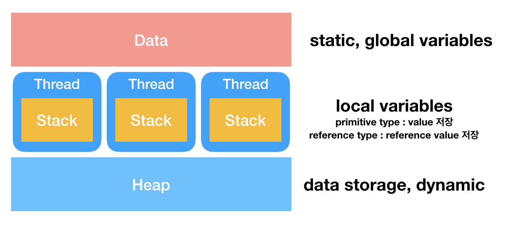
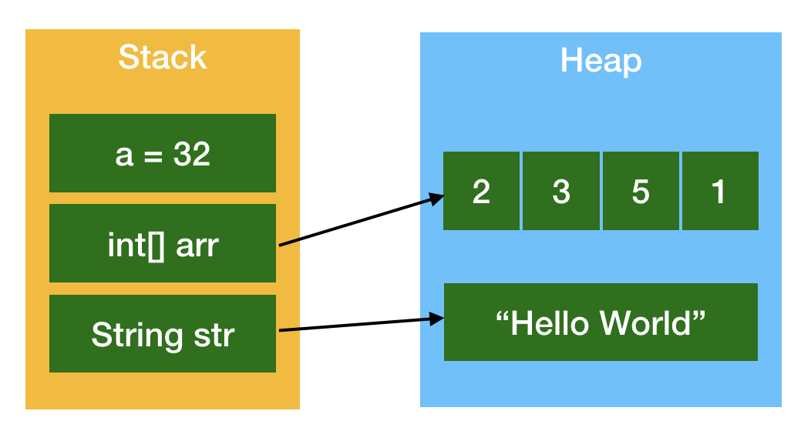

# 자바의 메모리 구조 및 구성
- Data
- Stack
- Heap




## Data
- global, static variables가 저장되는 영역이다.
- 프로그램의 시작과 함께 할당되며, 프로그램이 종료되면 소멸한다.

## Stack
- 프로그램의 실행 과정에서 임시로 할당되는 변수(local variables)가 저장된다.
- variable이 primitive type(int, char, boolean ...)라면 실제 값이 저장된다.
- 객체라면 reference value가 저장되며, 실제 데이터는 heap 영역에 저장된다.
- 런 타임에 그 크기가 결정된다.
- 메소드가 호출됧 때마다 그 메소드의 로컬 변수를 준비하고, 메소드 호출이 끝나면 메소드 내 local variables가 스택에서 제거된다.

## Heap
- 동적 데이터를 보관하는 저장소로, 런 타임에 그 크기가 결정된다.
- 힙 영역에 보관되는 메모리는 메소드 호출이 끝나도 사라지지 않고 유지된다.
- GB에 의해 지워지거나 JVM이 종료되면 사라진다.
- 'new'를 통해 생성된 Reference type의 실제 데이터가 저장되는 공간이다.

```java
public void blahblah() {
  int[] arr = new int[2];
  arr[0] = 1;
  arr[1] = 2;
}

// 실제 데이터(1, 2)는 heap 영역에 저장되고,
이 영역을 가르키는 참조값(reference value)이 stack 영역에 저장된다.
```



<hr/>
## Reference
- http://wanzargen.tistory.com/17
