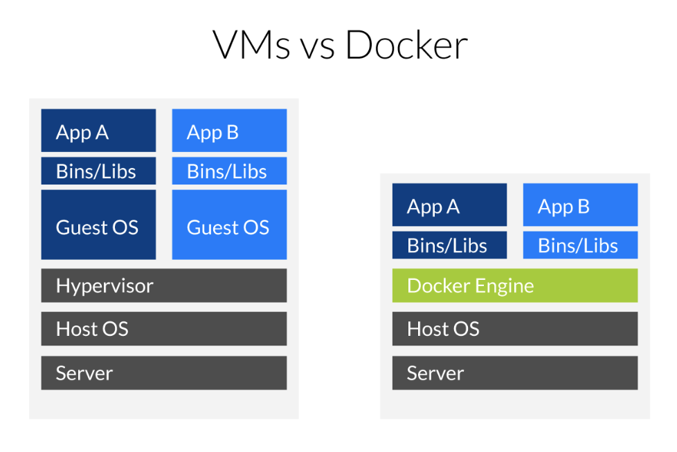

# [Docker](https://www.docker.com/)

컨테이너 기반의 오픈소스 가상화 플랫폼!

리눅스의 응용 프로그램들을 소프트웨어 컨테이너 안에 배치시키는 일을 자동화하는 오픈 소스 프로젝트이다.

## 컨테이너
컨테이너는 **격리된 공간에서 프로세스가 동작**하는 기술이다. 

가상화 기술의 하나인데 기존 방식과는 차이가 있다. 기존의 가상화 방식은 주로 OS를 가상화 하는 것이었다면, **컨테이너는 프로세스를 격리하는 방식**이다. 

따라서, 하나의 서버에 여러 개의 컨테이너를 구동할 수 있고, 서로 영향을 미치지 않고 독립적으로 실행되어 마치 가벼운 VM을 사용하는 느낌을 준다. 

실행중인 컨테이너에 접속할 수도 있다. 

컨테이너의 이점은 다양한 프로그램, 실행 환경을 컨테이너로 추상화하고 동일한 인터페이스를 제공하여 프로그램의 배포/관리를 단순하게 해준다.

## 이미지
**이미지는 컨테이너 실행에 필요한 파일과 설정 값 등을 포함하고 있으며, 상태값을 가지지 않고 변하지 않는다.**

컨테이너는 이미지를 실행한 상태라고 볼 수 있고, 추가되거나 변하는 값은 컨테이너에 저장된다. 

하나의 도커 이미지로 여러 개의 컨테이너를 생성할 수 있고, 컨테이너의 상태가 바뀌거나 삭제되더라도 이미지는 변하지 않고 그대로 남아 있다. 

도커 이미지를 구성하기 위한 파일은 Dockerfile 이다.

도커 이미지는 github 처럼 [Docker Hub](https://hub.docker.com/)에 등록하거나 저장소를 직접 만들어 관리 할 수 있다. 누구나 이미지를 업로드 하고 다운로드 받을 수 있다.

### 이미지 레이어(Image Layers)
이미지 구성시, base 이미지를 둘 수 있다. 
맨 위의 이미지부터 가장 밑 부분의 이미지까지 횡단하는 구조로 되어 있으며, **베이스 이미지(부모 이미지)들은 read-only 레이어**이다. 

베이스 이미지들의 파일 시스템은 병합 마운트(Union Mount) 방식으로 합쳐진다.

### 병합 마운트(Union Mount)

동일한 디렉토리에 여러 파일 시스템을 마운트하는 기술이다.

## 특징
- 이미지 및 컨테이너로 구성.
- Docker Engine을 통하므로 Guest OS 없이도 컨테이너 실행이 가능.
- Guest OS가 없으므로 VM과 비교시 가볍다. 빠른 실행 속도 보장.
- 하드웨어를 가상화 하지 않으므로, 메모리 엑세스, 파일 시스템, 네트워크 실행 성능 향상.
- Union mount: 동일한 디렉토리에 여러 파일 시스템을 마운트하는 기술
- Docker Registry Server를 통해 버전 관리가 가능.
- N 개의 서버에 동일한 코드를 배포해야 할 때, 반복적인 설정 작업을 줄일 수 있음.

---
## 참고
- https://subicura.com/2017/01/19/docker-guide-for-beginners-1.html
- https://rampart81.github.io/post/docker_image/
- https://medium.com/@jessgreb01/digging-into-docker-layers-c22f948ed612

