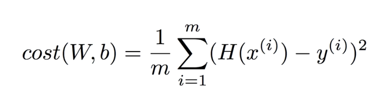

http://www.edwith.org/others26/lecture/10731/

하나의 가설을 세워야  Regression 모델 학습이 가능하다.
가설(H, Hyphothesis)의 형태가 일차 방정식으로 표현 가능할때 Linear Regression이라 칭한다.
> H(x) = Wx + b

Cost(Loss function): 우리가 세운 가설과 실제 데이터가 얼마나 다른지 계산하는 함수
cost(W,b)가 적을 수록 좋으며, minimize cost를 하기 위해 linear regression을 학습시킨다.
> (H(x) - y)^2

