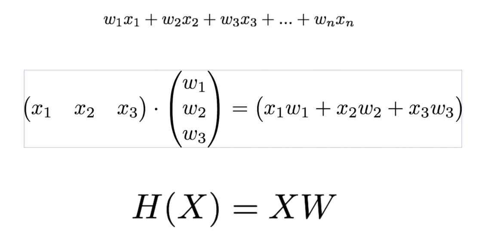
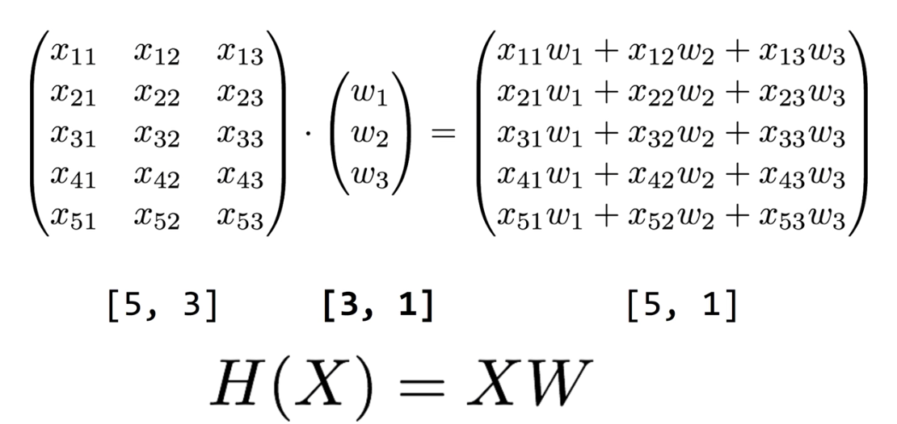

# Multi variable linear regression

Y를 결정하는데 있어 x는 n개 일 수 있다.

## Example
Regression using three inputs(x1, x2, x3)

|x1|x2|x3|Y|
|--|--|--|--|
|73|80|75|152|
|93|88|93|185|
|89|91|90|180|
|96|98|100|196|
|73|66|70|142|



## Hypothesis using matrix
- 행렬을 이용하면 여러 instance의 연산을 편리하게 할 수 있다.



- Theory:
```
H(x) = Wx + b
```

- Implementation(TensorFlow)
```
H(X) = XW
```
