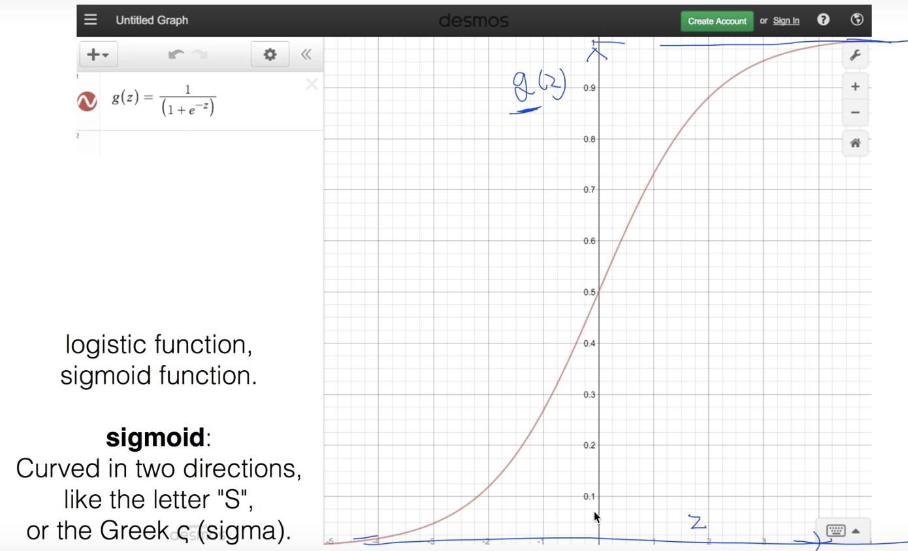
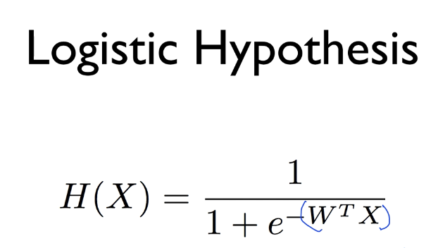

# Logistic Classification

## Binary Classification
Y를 true or false와 같은 형태로 분류할 수 있는 것.
보통 0 or 1로 인코딩하여 표현함.

### Example
- Spam Detection: Spam or Ham
- Facebook feed: show or hide
- Credic Card Fraudulent Transaction detection: legitimate or fraud

Linear regression을 사용할 수 없다.

H(x) = wx + b 이므로 hypothesis가 1을 초과할 수도 있기 때문.

그래서 나타난 것이 sigmoid(logistic function)

그래서

