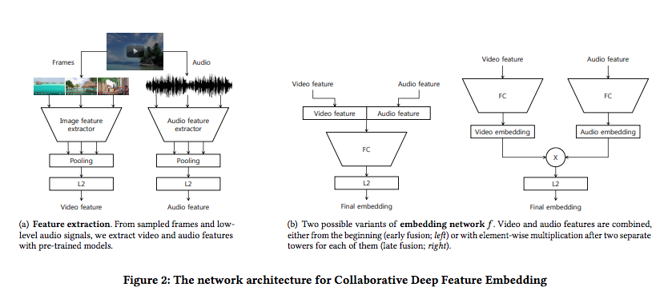
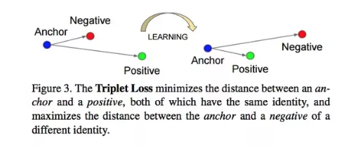
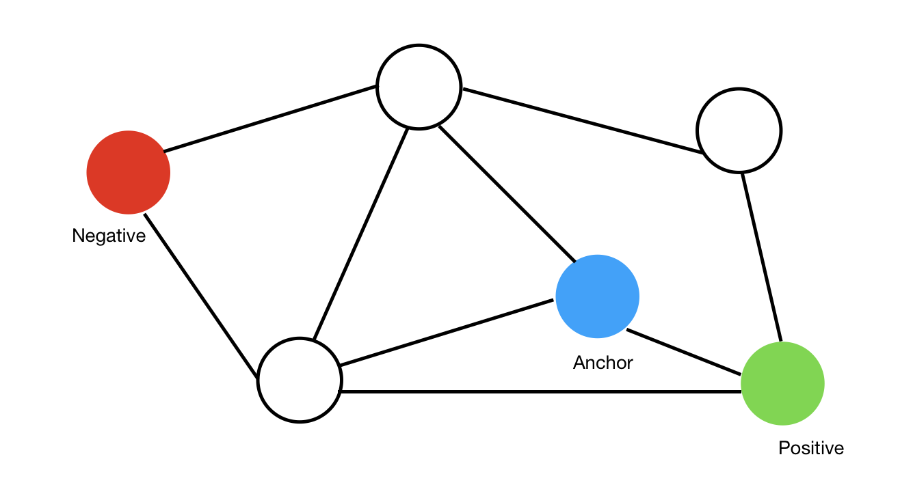

# Collaborative Deep Metric Learning for Video Understanding
## Video understanding
An image consists of matrix of RGB codes, and a video is a **sequence of images**.

### To understand,
```
Content + Metadata + Viewer signals(collaborative filtering, 누가 봤는지) -> Fuser -> 추천을 해주거나 유투브 채널 생성에 이용됨.
```
여러 정보를 종합해서 understanding 할 수 있는 환경이다.

검색 top에 노출되기 위해 metadata(title, description, ...)을 잘 작성해주기 때문.

### but, Google Photo?
- No labels, No metadata, No viewer signals
- Lots of videos

그래서 고안된 것이..

## Collaborative Deep metric learning
## Goal
- To learn a content-aware video embedding, using deep neural network.
- Metric learning: preserving video-video similarity.

## Flow
1. Pre-trained deep models 
2. Extract visual/audio features
3. embedding model
4. video embedding
5. nearest neighbor search
6. Then<br/>
 6.1. related video retrieval(다음 동영상 in youtube)<br/>
 6.2. user modeling(추천 동영상 in youtube) <br/>
 6.3. classifier <br/>
7. video annotation

### Relative video Feature extraction


### Embedding models: triplet loss

- train a model, preserving pairwise distance between videos.
- [anchor, positive] closer than [anchor, negative]
- anchor를 기준으로 positive를 가깝게, negative는 멀도록 training 하는 것.

Youtube -> [Neural Networks - Triplet Loss, Andrew NG](https://www.youtube.com/watch?v=LN3RdUFPYyI)

### [Collaborative filtering](https://ko.wikipedia.org/wiki/%ED%98%91%EC%97%85_%ED%95%84%ED%84%B0%EB%A7%81)
- 사용자들로부터 얻은 기호 정보에 따라 사용자들의 관심사들을 자동적으로 예측하는 방법 중 하나.
- Users implicitly collaborate to filter relevant items to themselves by annotating their preference.

### There exists a relative video graph
Anchor를 랜덤하게 선정, 그에 관련한 positive/negative를 선정해서 트레이닝 시킴.


#### Negative Reassignment
- Random negatives are too easy to train fine-grained similarity.
- For each {anchor, positive} pairs in mini-batch, reassign negatives to train well.

## Related video retrieval
Related video retrieval is a variant of video search or recommendation, where the query is a video and the response is a list of videos.
- On his experiment, Training : Eval = 7 : 3

### Thumbnail
- 비디오를 볼 때, 비디오를 전체 보지 않고, 추천할때 썸네일만으로 충분하지 않을까?
- But, entire video features more useful than thumbnail features.

### Parameter Tuning
- batch size: batch가 너무 크면 gpu over. 어떻게 해결할 수 있지 여러가지 실험 중.
- architectures: hidden layer 갯수 조정.


## Personalized Video Recommendation
- Given a user with watch history, rank videos in a candidate set according to the user's preference.
연관 비디오 추천에서의 쿼리는 '현재 시청중인 비디오' 였는데, personalized의 쿼리는 user임.

### Scalability issues
- 한 유저가 한 비디오를 볼때마다 candidates를 추천해줘야 함. 엄청난 연산..

### Optimizations
- pre-computing averaged watch history.
- Quantization: do we really need full precision of float(4-byte)?
- Caching multiplication of possible combinations for faster dot-product.


# Video Annotation/Classification
1. input: videos
2. 여러 피쳐 extraction
3. Machine Learning model
4. Korean food: 0.94, Cooking: 0.87, football: 0.02 ...

http://research.google.com/youtube8m/index.html

## Problem
Model as a **multi-labeled classification problem**.

## Annotation Model
use a fully connected layer followed by a [Mixture of Experts(MoE)](https://en.wikipedia.org/wiki/Mixture_of_experts) model for the multi-label classifier.

### [Mixture of Experts](https://en.wikipedia.org/wiki/Mixture_of_experts) classifier(MoE)
multiple experts(learners) are used to divide the problem space into homogeneous regions. 

An example from the computer vision domain is combining a neural network model for human detection with another for pose estimation.

=> logistic regression을 여러개 붙인 것!

## Effects
- 첫 시작은 유아용 비디오인데, 마지막에 성인용 비디오가 있는것도 걸러내줌

## Refer
- [Collaborative Deep Metric Learning for video understanding, paper](http://www.joonseok.net/papers/cdml.pdf)
