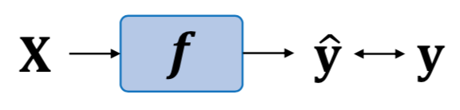
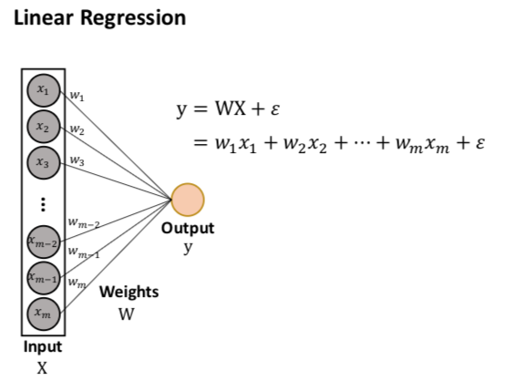
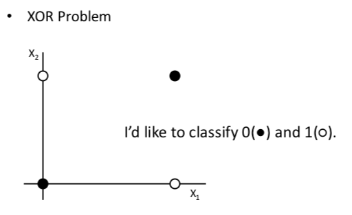
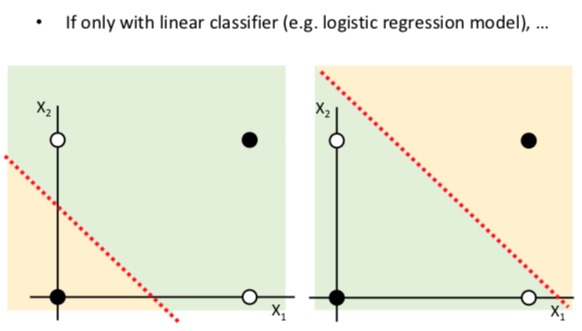
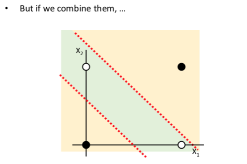
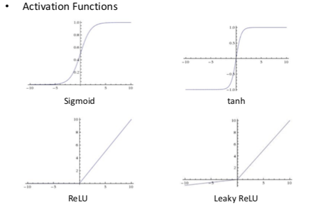
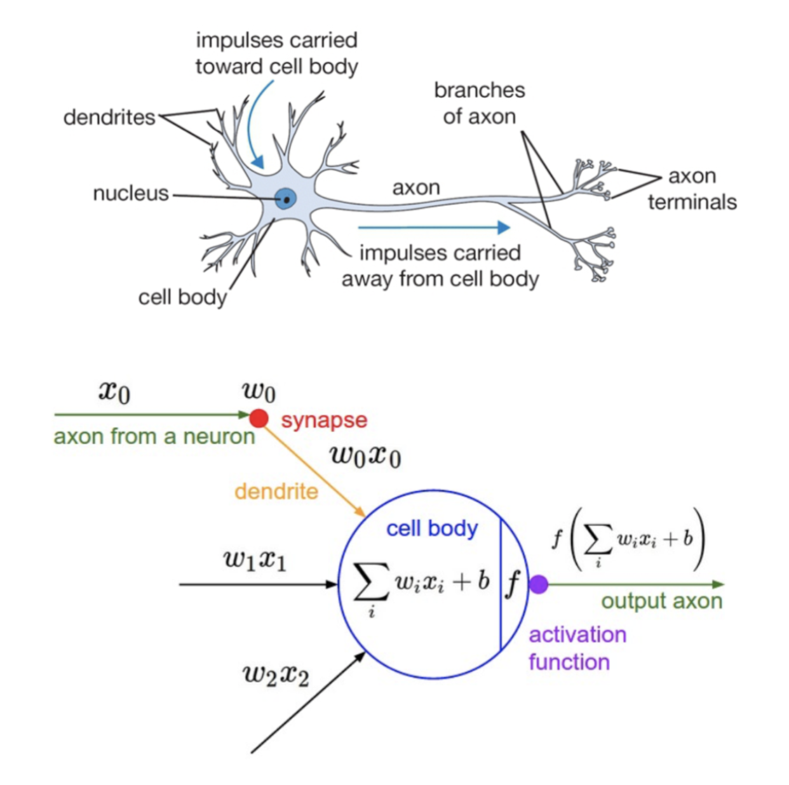
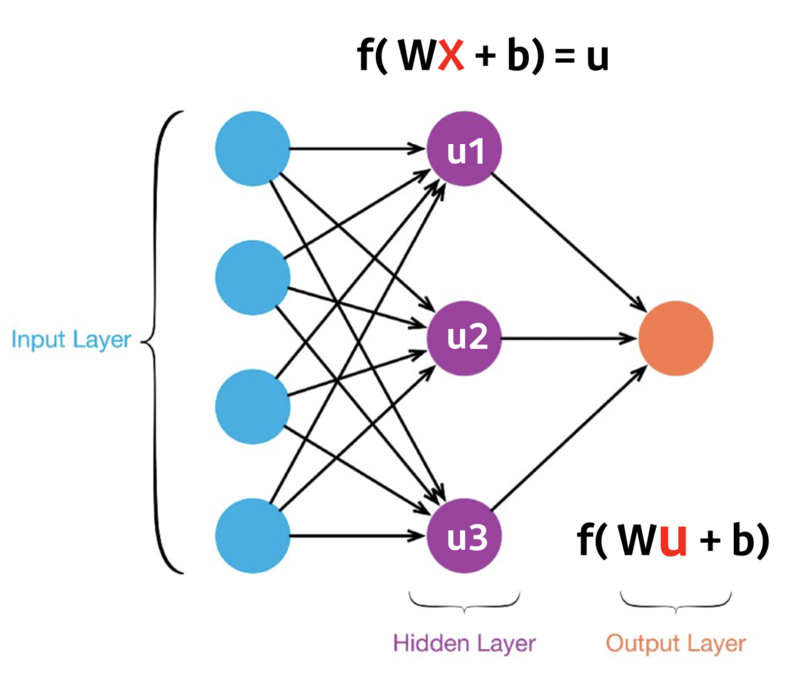

# Background
## Paradigm Shift
기존의 코딩: 조건을 line by line으로 써내려 가는 일.

```
앞으로의 코딩: 조건을 학솝 모델의 여러 가중치로 변환하는 일.
```

## Supervised Learning
파라미터(x)와 정답지(y)가 주어지고, 이를 통해 학습하게 하는 방법.


## Unsupervised Learning
https://en.wikipedia.org/wiki/Unsupervised_learning

## [Linear Regression](https://ko.wikipedia.org/wiki/%EC%84%A0%ED%98%95_%ED%9A%8C%EA%B7%80)
종속 변수 y에 대해 한 개 이상의 독립 변수(x)가  선형 상관 관계를 모델링하는 회귀분석 기법.

연속형 변수, 목록이 되기도 하며, 가중치(w)를 찾는 것이 목적이고 이 것이 곧 모델이다.



## Example
[타이타닉 생존자 예측하기](https://www.kaggle.com/c/titanic/data)

<hr/>

# Neural Network
XOR problem을 생각해보자.



Logistic은 linear 모형으로, 평면을 단순하게 나누는 것이라고 생각할 수 있다. 



Neural은 hidden layer를 여러 개 사용하여 모델을 생성하는 것이다.



각 노드에 대해 activation function을 추가하는 것이 중요하다. 

activation function을 추가해야 비선형 모델이 되게 되며, activation function을 추가하지 않는다면 계속 linear하게 될 것이다.





# [ANN(Artifical Nueral Network)](https://ko.wikipedia.org/wiki/%EC%9D%B8%EA%B3%B5%EC%8B%A0%EA%B2%BD%EB%A7%9D)
생물학의 신경망(뉴런)에서 영감을 얻은 통계학적 학습 알고리즘으로, 사람의 뇌구조를 수치화 한 모델이다.

ANN에서는 노드가 인공 뉴런의 역할을 하며, 노드 간의 결합이 모여 신경망을 구성하게 된다.

뉴런에는 크게 세가지의 기능으로 구성되어 있다.
1. 이전 뉴런에서 정보를 수신한다.
2. 정보를 조합해서 활성화 여부를 판단한다.
3. 뉴런에서 조합한 정보를 내보낸다.

ANN도 마찬가지이다.



# [DNN(Deep Neural Network)](https://ko.wikipedia.org/wiki/%EB%94%A5_%EB%9F%AC%EB%8B%9D#%EC%8B%AC%EC%B8%B5_%EC%8B%A0%EA%B2%BD%EB%A7%9D(Deep_Neural_Network,_DNN))
한 레이어의 뉴런으로는 복잡한 문제를 학습시키기가 어렵다. 

하여, 입력층(input layer)과 출력층(output layer) 사이에 여러 개의 hidden layer를 둔 ANN이라고 이해하면 된다.

한 개의 layer만 있는 경우를 생각해보자. 


이때, 각 노드는 '다른 관점'이라고 볼 수 있다. 

**주어진 input에 대해 다양한 관점에서 학습을 한 후, 이를 종합해서 output으로 내려주는 기본적인 구조를 가지고 있다.**

## Hidden layer가 여러개라면?


복잡한 문제를 다양한 관점에서 관찰하고 그 output을 다시 input 으로 취급해서 학습을 시켜나가니 복잡한 문제를 풀기에 좋다.

그렇다면 DNN은 몇 겹의 hidden layer를 가져가야 할까? 이 것은 상황에 따라 다르며, 설계자(우리)가 설계하기 나름이다.

항상 깊은(deep hidden layers) 네트워크가 좋은 구성은 아니다. 

뭐든 적정점이 있으며, 불필요하게 깊게 구성할 경우 [overfitting](#overfitting) 현상이 발생한다.

적절한 점을 찾는 것이 중요하다.

### [Overfitting](https://en.wikipedia.org/wiki/Overfitting)
너무 과도하게 데이터에 대해 모델을 learning한 경우를 의미한다. 과도 학습된 탓에 전보다 poor 결과를 내놓게 된다.

#### reference
- http://sanghyukchun.github.io/59/
- http://wiki.fast.ai/index.php/Over-fitting

## Neural Network 학습 방법
Error function을 정의 한 후, error가 제일 작은 weights(global minimum)를 찾는다.

### 1. Gradient Descent
미분값이 0에 가장 가까운 값을 구하면 됨.
한 개의 weight에 대해 global minimum 값을 구할 때는 괜찮지만, weight가 한 두 개가 아니라면 구하기 어렵다.

### 2. [Chain Rule](https://ratsgo.github.io/deep%20learning/2017/05/14/backprop/)
forward, backward propagation 두 가지의 방법으로 학습시킨다. 
 
#### Forward propagation
- 주어진 weights로 input data로 output을 계산해 내는 input -> output의 일반적인 흐름이다.
- loss = label - output

#### [Backward propagation](https://en.wikipedia.org/wiki/Backpropagation)
- backward의 경우, output에서 얻어진 weight를 미분해서 다시 layer 내의 가중치 값을 업데이트 시켜주는 방법으로 loss를 최소화 하기 위한 방법이다.
- 실제 뉴럴 네트워크에는 노드가 많은 꽤 큰 계산 그래프를 이루고 있다. 이 네트워크는 최종 정답과 비교한 후, loss를 계산한다.
- 목적은 뉴럴 네트워크의 오차를 줄이는 것이므로, output neuron에서 계산된 error(loss)를 각 edge들의 weight로 사용해 바로 이전 layer의 neuron들이 얼마나 error에 영향을 미쳤는지 계산한다.
- reference: http://sanghyukchun.github.io/74/

## 학습 시키려면?
1. Neural Network 구조를 만든다.
2. Error(=Loss) function을 정의한다.
3. 데이터 학습
4. Loss가 최소가 되는 weight를 찾는다.

## 뭘 해볼 수 있을까?
### [GAN(Generative Adversarial Network)](https://en.wikipedia.org/wiki/Generative_adversarial_network)
Unsupervised ML에서 사용되는 알고리즘 중 하나로, (서로 잡고 쫓기는) 두 개의 neural networks로 구성되어 있다.

### 어떻게?
1. 가짜와 진짜를 잘 판별하는 모델을 만든다.
2. 진짜 같은 가짜를 만들어내는 모델을 만든다.
3. 두 모델 모두 학습 시킨다.
4. 1번 모델이 잘 판별해낼 수 없을 때까지 2번을 학습시키다보면, 이런 재밌는 것들을 해볼 수 있게 된다.

