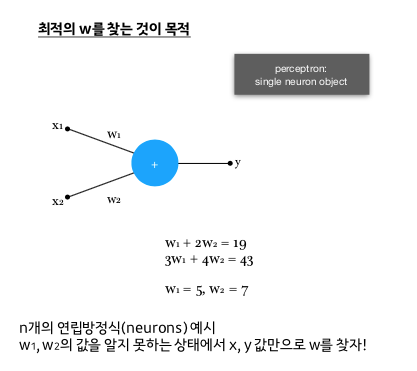
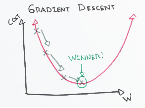

# tensorflow로 타이타닉 생존자 예측하기

## 참고
https://github.com/kidokim509/kaggle_titanic

## Data
https://www.kaggle.com/c/titanic/data


## Perceptron


## [Gradient Descent Graph](http://ml-cheatsheet.readthedocs.io/en/latest/gradient_descent.html)
w는 변수다. The graph의 x축이며, loss가 최소인 (이 그래프의 미분 값이 0인) w를 찾아야 한다.



## Tensorflow
### [Tensor](https://en.wikipedia.org/wiki/Tensor)
행렬, 스칼라들 간의 선형 관계를 나타내는 기하적 대상. 벡터 계산을 단순화하기 위해 여러 같은 성질의 벡터를 한 행렬 안에 표기하고 그것을 단순화.

- [What's a Tensor?](https://www.youtube.com/watch?v=f5liqUk0ZTw)
- [Tensors Explained Intuitively](https://www.youtube.com/watch?v=CliW7kSxxWU)

### [placeholder](https://www.tensorflow.org/api_docs/python/tf/placeholder)
- Placehoder for a tensor that will be always fed.
- 데이터를 받아줄 곳

### [softmax](https://www.tensorflow.org/api_docs/python/tf/nn/softmax)
softmax: input -> 상호간의 확률로 표현해주는 func
```
7        0.7
    ->
3        0.3
```

## Titanic
- age, pclass, sex에 대한 절대적인 값의 범위는 서로 다르므로 가중치가 예상과는 다르게 적용될 수도 있다.
- 하여 mean reduced해서 가중치 편차를 최소한으로 한다.

