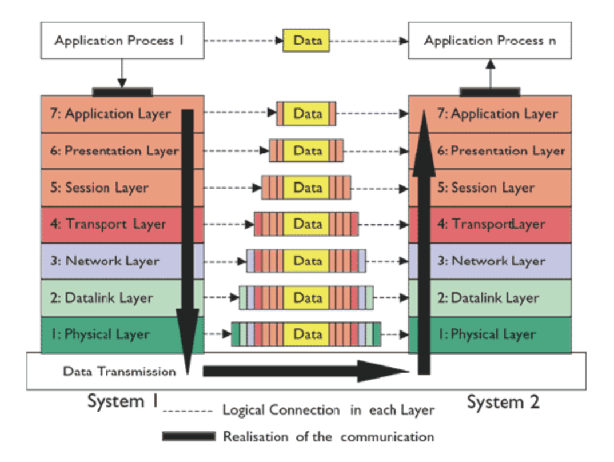

# OSI 7-layer
OSI는 Open System Interconnection의 약자로, ISO에서 정의한 7 계층의 통신 규약 모델이다.
업체마다의 통신 규약이 달라 이기종간 통신 문제가 발생하게 되면서, 이를 통일, 표준화 하고자 한 목적이 있다.
 

# PDNT-SPA
통신 상에 장애가 발생했을 때, 7계층을 순서대로 체크하면서 문제의 원인이 어떤 계층인지 파악한다고 해보자.

## 1. Physical Layer
**랜선, 케이블** 이라고 생각하면 된다.

물리적인 접속에 대한 정의.
상위 계층에서 전달 받은 데이터를 전기 신호로 바꿔 전송하는 역할

## 2. Data-link Layer
**브릿지, L2 스위치** 라고 생각하면 된다.

물리 계층을 통해 송/수신 되는 데이터의 흐름과 오류를 관리. 
MAC주소를 가지고 통신이 가능한 계층. 컴퓨터간 직접 연결이 가능할 경우 Layer 2까지만 있어도 통신이 가능하다.

## 3. Network Layer
**라우터, L3 스위치** 라고 생각하면 된다.

데이터를 목적지까지 안전하고 빠르게 전달하는 것(=라우팅)이 목적이다.
Layer 2에서 구성된 것은 컴퓨터 간의 직접 연결이었다면, 여기서는 라우터가 큰 역할을 하면서 '네트워크'를 구성하는 것이다. 
데이터를 어떤 경로로 전달해야 하는지 경로를 배정한다.

## 4. Transport Layer
**TCP, UDP**

정보를 분할하고 다시 합치는 과정을 담당한다. IP 주소와 포트 번호로 접근한다.

## 5. Session Layer
통신 사이의 연결을 유지하기 위한 레이어로, **세션** 을 관리.

## 6. Presentation Layer
다양한 데이터 포맷을 일정한 포맷으로 변환하고 압축하는 레이어로, 암/복호화가 여기서 일어난다.

## 7. Application Layer
** HTTP, HTTPs 프로토콜 **
데이터와 사용자를 연결시켜주는 인터페이스로, 크롬이나 파이어폭스 같은 어플리케이션이 해당된다.

