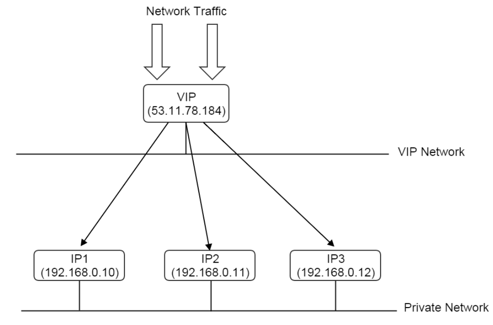

# DNS
Doman Name System의 약자로 도메인을 IP로 변환하는 기술이다. 
[How DNS Works  ](https://youtu.be/2ZUxoi7YNgs)

 

# [IP](https://ko.wikipedia.org/wiki/IP_%EC%A3%BC%EC%86%8C)
Internet Protocols의 약자로 컴퓨터 네트워크에서 장치들이 서로를 인식하고 통신을 하기 위해서 사용하는 특수한 번호이다.

## 주소
### IPv4
주소 표현에 4바이트(32-bit)를 사용 

(0000 0000).(0000 0000).(0000 0000).(0000 0000) 
(0\~255).(0\~255).(0\~255).(0\~255) 

### Subnetwork(subnet)
IP network의 논리적인 세분화.

#### Netmask
address를 bit로 나타내었을 때, prefix length

(Address)/(Netmask) 
192.168.0.0/12 
Address: 11000000.1010 1000.00000000.00000000 
Netmask: **11111111.1111** 0000.00000000.00000000 
---------------------------------------------------------- 
Network: **11000000.1010** 0000.00000000.00000000 
MinHost: **11000000.1010** 0000.00000000.00000000 
MaxHost: **11000000.1010** 1111.11111111.11111110 
> http://jodies.de/ipcalc 에서 연습해보기 좋다.

## 종류
### Public IP
공인 IP. 전세계 유일무이. 
국가별 할당 range가 다르다.

### Private IP
네트워크, 라우터 내에서 구분되는 사설 IP. 외부에서는 찾지 못하고 같은 네트워크 망 내에서만 찾아낼 수 있다. 
A 라우터에 192.168.10이 있을 수 있고, B 라우터에도 192.168.10이 있을 수 있다. 이때, 192.168.10는 사설 IP.

### Virtual IP
물리 장비에서 관리하는 IP가 아니라 Host에 붙는 IP. 
VIP -> 여러 개의 private IP로 라우팅 

## 참고 링크
- [IP address, wikipedia](https://en.wikipedia.org/wiki/IP_address)
- [Subnetwork, wikipedia](https://en.wikipedia.org/wiki/Subnetwork)
- [What is DNS, by AWS](https://aws.amazon.com/ko/route53/what-is-dns/)
- [IP 종류에 대한 기초지식](http://blog.daum.net/tlos6733/75)
- [국가별 IP 주소 대역 현황](https://xn--3e0bx5euxnjje69i70af08bea817g.xn--3e0b707e/jsp/infoboard/stats/ipCurrent.jsp?nationCode1=KR)
- [Virtual IP](http://zstackdoc.readthedocs.io/en/latest/userManual/vip.html)
