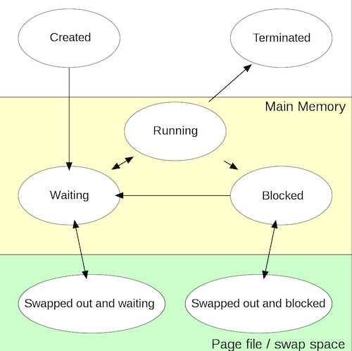
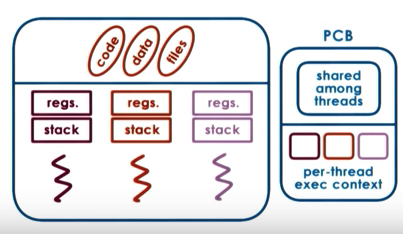

# Process vs Thread

## Process
자원을 할당 받아 실행되고 있는 컴퓨터 프로그램의 instance 단위. 
OS에 따라, 멀티 쓰레딩 환경으로 실행될 수도 있으며, 프로세스 관리는 운영 체제의 중요한 부분이다. 
코드, 데이터, 파일을 포함하고 있다.

### Process states

#### 1. Created
- 하드디스크 등의 [보조 기억 장치](https://en.wikipedia.org/wiki/Auxiliary_memory)에 저장되어 있던 프로그램 코드를 메인 메모리에 로드.
#### 2. Waiting
- 스케줄러가 context switching을 할 때 까지 기다린 후, 프로세스를 프로세서에 로드.
#### 3. Running
- 프로세서가 프로세스를 실행.
#### 4. Blocked
- 사용자의 input 혹은 file I/O 등 프로세스 실행에 필요한 리소스를 기다려야 할 때.
- 기다릴 필요가 없어지면 (blocked -> waiting) 상태로 전이.
#### 5. Terminated
- 프로세스의 실행이 끝나거나, OS에 의해 종료되었을 때 이 상태로 전이되며, 메인 메모리에서 제거된다.

## Thread
프로세스 내에서 실행되는 흐름의 단위. 
코드, 데이터, 파일 등 프로세스 내의 가상의 것부터 물리적인 모든 것들을 공유. 
하지만, 각 쓰레드는 다른 input으로 실행되는 독립적인 실행체 이므로 모두 다른 주소를 가진다. 
각 스레드가 각자의 program counter(stack pointer, stack, thread-specific registers)를 가질 필요가 있다는 의미이다.

### Multi-threading
- 운영 체제에 의해 지원되는 기능이며 CPU에 따라 성능이 결정 된다.
- 목적: 병렬적으로 동시에 여러 컨텍스트를 처리하여 자원을 효율적으로 사용. 
(+) 동시에 여러 컨텍스트를 처리할 수 있다. 멀티 프로세싱 대신 멀티 스레딩이 가지는 장점은 프로세스를 생성 및 자원 할당에 대한 시스템 콜을 줄일 수 있다는 것. 
(+) 프로세스 간의 통신 보다 스레드 간의 통신 비용이 적다. 
(-) 스레드 간 공유하는 자원(static ...)을 잘 관리해야 한다. 

## 참고 링크
- [Process, wikipedia](https://en.wikipedia.org/wiki/Process_(computing))
- [Thread, wikipedia](https://en.wikipedia.org/wiki/Thread_(computing))
- [Multithreading, wikipedia](https://en.wikipedia.org/wiki/Multithreading_(computer_architecture))
- [Process vs Thread, youtube](https://www.youtube.com/watch?v=Dhf-DYO1K78)
