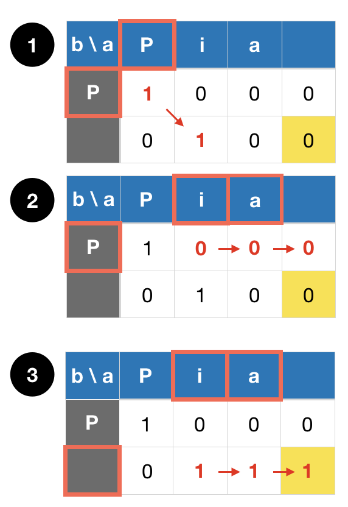
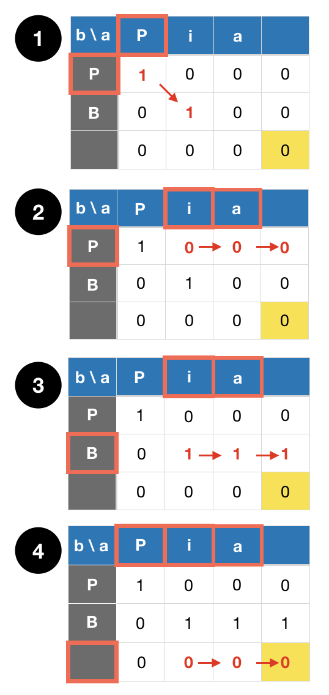

_dynamic programming 연습하기 좋다! 꼭 다시 풀어볼 것_

# Problem
https://www.hackerrank.com/challenges/abbr/problem?h_l=playlist&slugs%5B%5D=interview&slugs%5B%5D=interview-preparation-kit&slugs%5B%5D=dynamic-programming
```
You can perform the following operations on the string, a:

Capitalize zero or more of a's lowercase letters.
Delete all of the remaining lowercase letters in a.
Given two strings, a and b, determine if it's possible to make  equal to  as described. 
If so, print YES on a new line. Otherwise, print NO.
```

# Solution 1

a와 b를 차례로 돌도록 index를 담은 pointer를 두 개(각각 pa, pb)를 이용할 것이다.
b[pb]는 항상 대문자 이므로, a[pa]를 `matched`로 취급할 경우와 취급하지 않을 경우를 or 조건으로 이어주면 완벽하게 dp 스러운 로직이 탄생한다.
고려해야 할 경우는 다음과 같다.

| Case | a[pa] | a[pb] | Matched Result |
|:----:|:-----:|:-----:|:------:|
| # 1  |  a    |   A   | true || false |
| # 2  |  A    |   A   | true |
| # 3  |  b    |   A   | false(skip and continue finding) |
| # 4  |  B    |   A   | false(termination) |

```java
boolean abbreviatable(char[] as, int pa, char[] bs, int pb) {
  if(pb >= bs.length) {
    // ap 이후의 a에 대문자가 남아있다면 결과값은 false, otherwise true.
    for(int i = pa; i < as.length; ++i) {
      if(Character.isUpperCase(a[pa])) {
        return false;
      }
    }
    return true;
  }
  // a만 계속 증가하다보면 a가 끝날 수도 있음
  if(pa >= as.length) {
    return false;
  }
  
  char ca = as[pa];
  char cb = bs[pb];
  if(Character.isUpperCase(ca)) {
    if(ca == cb) {    // case #2
      return abbreviatable(as, pa + 1, bs, pb + 1);
    }
    else {            // case #4
      return false;
    }
  }
  else {
    if(ca == Character.toLowerCase(cb)) {  // case #1
      return abbreviatable(as, pa + 1, bs, pb + 1) || abbreviatable(as, pa + 1, bs, pb);
    }
    else {                                // case #3
      return abbreviatable(as, pa + 1, bs, pb);
    }
  }
}

String abbreviated(String a, String b) {
  char[] as = a.toCharArray();
  char[] bs = b.toCharArray();
  
  if(as.length < bs.length) {
    return "NO";
  }
  
  return abbreviatable(as, 0, bs, 0) ? "YES" : "NO";
}

```

# Solution 2
large case에 대해서는 timeout이 발생한다.
어떻게 하면 timeout을 없앨 수 있을까?

## Cache를 이용한다!
a의 포인터인 pa와 b의 포인터인 pb를 기준으로 해당 포인터부터의 문자들이 매치가 되는지 결과값을 담은 것을 cache[pa][pb]에 담는다.

```java
int abbreviatable(char[] as, int pa, char[] bs, int pb, int[][] cache) {
  if(pb >= bs.length) {
    for(int i = pa; i < as.length; ++i) {
      if(Character.isUpperCase(a[pa])) {
        return false;
      }
    }
    return true;
  }
  if(pa >= as.length) {
    return false;
  }
  
  if(cache[pa][pb] == -1) {
    char ca = as[pa];
    char cb = bs[pb];
    
    if(Character.isUpperCase(ca)) {
      cache[pa][pb] = (ca == cb) ? abrreviatable(as, pa + 1, bs, pb + 1, cache) : 0;
    } 
    else if(ca == Character.toLowerCase(cb)) {
      cache[pa][pb] = abbreviatable(as, pa + 1, bs, pb + 1, cache) | abbreviatable(as, pa + 1, bs, pb, cache);
    }
    else {
      cache[pa][pb] = abbreviatable(as, pa + 1, bs, pb, cache);
    }
  }
  
  return cache[pa][pb];
}

String abbreviated(String a, String b) {
  char[] as = a.toCharArray();
  char[] bs = b.toCharArray();
  
  if(as.length < bs.length) {
    return "NO";
  }
  
  int[][] cache = new int[as.length][bs.length];
  for(int[] row : cache) {
    Arrays.fill(row, -1);
  }
  return abbreviatable(as, 0, bs, 0, cache) == 1 ? "YES" : "NO";
}
```
a의 길이를 N, b의 길이를 M으로 가정할 때,<br/>
Time complexity: O(N * M)<br/>
Space complexity: O(N * M)


# Solution 3(BEST)
재귀 없이 2차원 배열만으로 해결하기!!

> Case 1


> Case 2


1. matched 값을 축적하고 있는 2d array를 이용하며, 배열의 길이는 `[b.length + 1][a.length + 1]`이다. 
  배열은 `row = 0 ~ a.length + 1, col = 0 ~ b.length + 1`까지 iterate 해야 한다. case 2 같은 경우 때문이다.
2. a의 current character(`ac`)가 소문자라면, b의 current character(`bc`)를 찾지 못했다고 가정하고 다음 a character로 찾기 위해 `[row][col+1]`로 현재 값을 전달한다.
3. `ac`가 대문자이고 `bc`와 같다면, b의 next character를 찾기 위해 현재 값(`[row][col]`)을 `[row + 1][col + 1]`로 전달한다. 
4. `ac`가 소문자이고 대문자화 했을 경우 `bc`와 같다면, 이 때에도 3과 같이 적용한다.
5. 최종 결괏값은 `matchd[b.length][a.length]`에 있을 것이며 2~4의 값을 전달하기 위해서는 `matched[0][0] = true` 여야 한다.

```java
boolean abbreviated(String a, String b) {
  char[] as = a.toCharArray();
  char[] bs = b.toCharArray();
  
  final int ALEN = as.length;
  final int BLEN = bs.length;
  if (ALEN < BLEN) {
    return false;
  }
  
  boolean[][] matched = new boolean[BLEN + 1][ALEN + 1];
  matched[0][0] = true;
  for(int bi = 0; bi <= BLEN; ++bi) {
    for(int ai = 0; ai <= ALEN; ++ai) {
      if(ai < ALEN && Character.isLowerCase(as[ai]) {
        matched[bi][ai + 1] |= matched[bi][ai];
      }
      if(ai < ALEN && bi < BLEN && Character.toUpperCase(as[ai]) == bs[bi]) {
        matched[bi + 1][ai + 1] |= matched[bi][ai];
      }
    }
  }
  return matched[BLEN][ALEN];
}
```
a의 길이를 N, b의 길이를 M으로 가정할 때,<br/>
Time complexity: O(N * M)<br/>
Space complexity: O(N * M)
