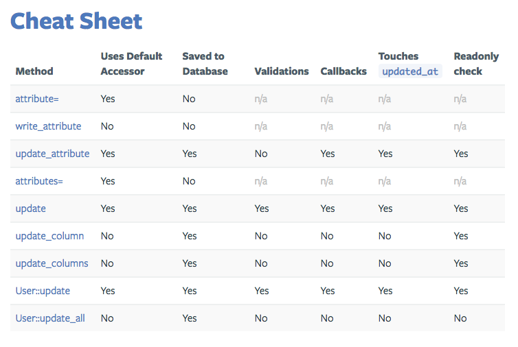

# [ActiveRecord](https://guides.rorlab.org/active_record_basics.html)
비지니스 데이터와 비지니스 로직을 표현하기 위한 Rails에서 제공하는 ORM(Object Relational Mapping) class이다.

## [Callbacks](https://guides.rubyonrails.org/active_record_callbacks.html)
ActiveRecord 객체에는 life cycle이 있다. 

create -> update -> destroy

각 사이클마다 hooking 할 수 있는 메소드들을 제공한다.(ex: data validation)

### validate
Activerecord의 column(attribute)에 대해 데이터가 insertable/updatable 한 지 validation 한다.

```ruby
class User < ApplicationRecord
  validates :email, :phone, presence: true
end
```

### before_validation
`validate`가 실행되기 전 실행되는 callback.
```ruby
class User < ApplicationRecord
  before_validation :delete_dashes_from_phone
  
  validates :email, presence: true
  
  private
  
  def delete_dashes_from_phone
    self.phone = self.phone.delete('-')
  end
end
```

### after_validation
`validate`가 실행된 후 실행되는 callback.

기타 데이터 정합성에 대한 체크가 끝나면, 이메일의 도메인을 제거한 아이디 값을 username으로 지정하게 하는 로직을 작성해보자.
```ruby
class User < ApplicationRecord
  before_validation :delete_dashes_from_phone
  
  validates :email, :phone, presence: true
  
  after_validation :set_username
  
  private
  
  def set_username
    self.username = self.email.split('@').first
  end
  
  def delete_dashes_from_phone
    self.phone = self.phone.delete('-')
  end
end
```

### Conditional callback
특정 조건에 맞을 때만 callback이 실행되게 할 수 있다.
```ruby
class Order < ApplicationRecord
  before_save :normalize_card_number if: :paid_with_card?
end
```

### Creating an object
- before_validation
- after_validation
- before_save
- around_save
- before_create
- around_create
- after_create
- after_save
- after_commit/after_rollback

### Updating an Object
- before_validation
- after_validation
- before_save
- around_save
- before_update
- around_update
- after_save
- after_commit/after_rollback

### Destroying an Object
- before_destroy
- around_destroy
- after_destroy
- after_commit/after_rollback

## update attribute cheat sheet

