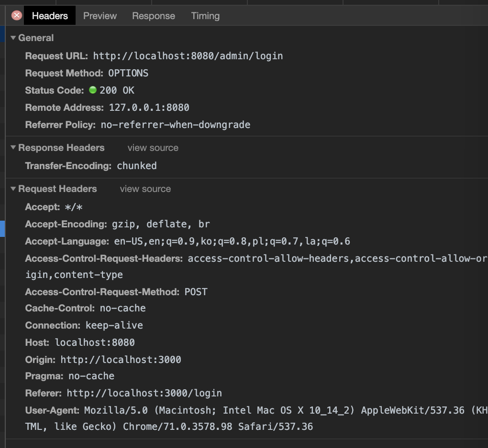

# CORS?
Cross-Origin Resource Sharing

도메인이 다른 사이트들 간에 리소스를 공유하는 것을 의미한다. 보안 상의 이슈로 원칙적으로는 금지(혹은 경고)하지만, 예외적으로 설정을 하면 사용할 수도 있다.
반드시 신뢰할 수 있는 사이트에 대해서만 제한적으로 CORS를 허용하도록 하자.

# 문제 발생
2019.1.6~2019.1.10까지 나를 괴롭힌 문제이다.

Nuxt.js + Rails API로 구성 중인 프로젝트인데, 

클라이언트에서 서버로 요청을 보낼 경우, CORS policy에 어긋나기 때문에 요청을 처리할 수 없다는 Network Error를 받았다.


**Postman으로 Rails API를 찔러보면 예상한 응답이 잘 나왔다.**


## 의심1. Request Header가 문제다.
따라서 나는 request header가 제대로 설정되지 않았다고 생각했다.

### 헤더를 바꿔보자.
헤더 설정을 바꿔도 소용이 없었다. 똑같은 에러가 계속 발생했다.

Request network를 보니 아래와 같이 POST가 아니라 OPTIONS method로 리퀘스트를 보내고 있다.



흠, postman에서는 잘 동작한 걸 보니, axios에서 헤더를 잘못 설정하고 있는 걸까?

axios에 설정이 제대로 되도록 해보자. (try/fail만 몇일 삽질했다.)

- nuxt.config.js에도 넣었다가, 
- plugins/axios.js를 만들어서 그 아래에 header를 설정하게도 해봤다가, 
- request를 보낼 때 일일히 config 및 header를 설정해서 보내도 결과는 똑같았다.(참담쓰)
```js
this.$axios.$post(url, data, {
  headers: {
    'Access-Control-Allow-Origin': '*'
  }
})
```

슬슬 졸려지기 시작했다.

### 그런데 왜 OPTIONS method로 requesting 하는걸까?

`HTTP request sending OPTIONS instead of POST` 라고 검색해보니 나와 비슷한 문제를 겪고 있는 [이슈](https://github.com/axios/axios/issues/475)를 발견했다.

OPTIONS가 먼저 불리는 이유는 [Preflighted Requests](https://developer.mozilla.org/en-US/docs/Web/HTTP/CORS#Preflighted_requests)라고 불리는 녀석 때문이었다.

chrome에서 POST, PUT 이런 메소드를 보낼때에는 지원하는 요청 타입인지 확인하기 위해 OPTIONS로 reuqest를 보내고 서버가 이에 대해 ok를 해주면 그다음에 real request를 보내는 것이다.

### 몇 번 졸았다.
꿈 속에서 산신령을 만났다.
Rails 서버 쪽에 설정에 문제가 있는것은 아닐까?

에러메세지를 자세히 읽어보니, `Response to preflight request doesn't pass access control check:...`

**doesn't pass**라고 하는 것을 보니 서버쪽에서 **OPTIONS request를 처리하지 못하는 것은 아닐까** 라는 생각이 들었다.

Rails에서 이런 것들을 관리하고 있는 곳은 두 곳이다. Middleware인 [Rack::Cors](https://github.com/cyu/rack-cors), 일반 라우트(`routes.rb`). 두 곳을 확인해보기로 했다.

## 의심 2. 정말 서버 문제일까?
서버쪽 설정을 살펴봤더니 아래와 같이 설정이 되어있었다. 고로, Nuxt.js가 띄워져 있는 클라이언트 서버는 API 서버 입장에서 CORS 대상이 아니었던 것이다.

```ruby
config.middleware.insert_before 0, Rack::Cors do
  allow do
    origins 'domain A', 'domain B'
    resource '*', methods: [:get, :post, :put, :delete, :options], credentials: true,
             headers: ['Accept', 'Authorization', 'Cache-Control', 'Content-Type', 'DNT', 'If-Modified-Since', 'Keep-Alive', 'Origin', 'User-Agent', 'X-Mx-ReqToken', 'X-Requested-With']
  end
end
```


### 해결!

- origins에 client 도메인 추가
- `credentials: true`을 삭제
> Credentials sets the Access-Control-Allow-Credentials response header. Note: If a wildcard (*) origin is specified, this option cannot be set to true. Read this security article for more information.
- 모든 헤더에 대해 허용

```ruby
config.middleware.insert_before 0, Rack::Cors do
  allow do
    origins 'domain A', 'domain B', 'domain C'
    resource '*', methods: [:get, :post, :put, :delete, :options]
             headers: :any
  end
end
```

#### 덧, request header도 손보긴 해야한다.

내가 제공하는 API는 html/json response를 모두 지원하고 있으므로, `'Accept': 'application/json'` 과 같은 헤더를 덧붙여 주긴 해야 한다.


## 느낀점

- 해결이 되니 개운하다.
- 바보같았다. 결국 에러메세지 안에 힌트가 있었던건데, 클라이언트의 request header만 문제가 있을거라 생각하고, 그쪽 파는데 집중했다. 특히 Nuxt/axios쪽.
- 왜 Nuxt/axios에만 집착했을까 생각해보니, postman에서 request를 날렸을 때에는 expected 대로 행동해서 그런 것 같다.


---
Rails API + Nuxt.js로 웹을 구성하는 또다른 동지를 만났다. 잘 정리해둔 [글](https://medium.com/@fishpercolator/how-to-separate-frontend-backend-with-rails-api-nuxt-js-and-devise-jwt-cf7dd9da9d16)을 읽어봐도 좋을 듯하다.

