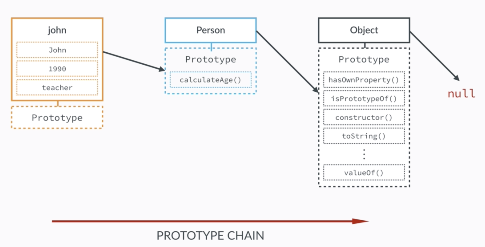
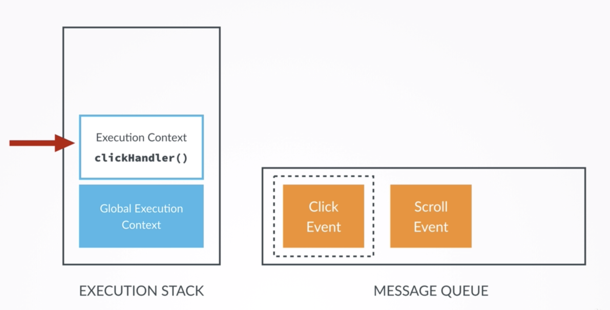

# Javascript

Javascript is an object-based script language used in front-end and back-end. In front-end, it is used to handle events, motions and etc.

## History
- 1996: Changed from LiveScript to Javascript to attract Java adevelopers.Javascript has almost nothing to do with Java.
- 1997: ES1(ECMAScript1) became the first version of the JavaScript language standard:
  - ECMAScript: The language standard.
  - JavaScript: The language in practice.
- 2009: ES5 was released with lots of new features.
- 2015: ES6/ES2015 was released: **the biggest update to the language ever.**
- 2015: Changed to an **annual release cycle.**
- 2016/2017/... : ES7/ES8/... will release.

# Syntax
## Equality Operators

### Type coersion
With use of `==` operator, it converts types string to integer, or etc.
```js
23 == '23' // returns true

var date = new date();
console.log(date); // Mon Oct 15 2018 08:24:57 GMT+0900 (Korean Standard Time)
date == "Mon Oct 15 2018 08:24:57 GMT+0900 (Korean Standard Time)" // returns true
```
### Equality operators
With use of `===` operator, it does not convert types and compare.
```js
23 === '23' // returns false


var date = new date();
console.log(date); // Mon Oct 15 2018 08:24:57 GMT+0900 (Korean Standard Time)
date === "Mon Oct 15 2018 08:24:57 GMT+0900 (Korean Standard Time)" // returns false
```


## [Objects](https://developer.mozilla.org/ko/docs/Learn/JavaScript/Objects/Basics)

Javascript is object oriented programming language. Almost things are object.

- Primitives: numbers, strings, booleans, undefined, null
- Object: arrays, functions, objects, dates, wrappers for numbers, strings, booleans, ...

### Inheritance

One object is based on another object.

### [Prototype](https://developer.mozilla.org/ko/docs/Learn/JavaScript/Objects/Inheritance)

Every Javascript object has a prototype property, which makes inheritance possible in Javascript.

###  [How Inheritance work? PROTOTYPE CHAINS](https://developer.mozilla.org/ko/docs/Web/JavaScript/Guide/Inheritance_and_the_prototype_chain)

The prototype property of an object is where we put methods and properties that we want other objects to inherit.




function `calculateAge` is not a prototype of `Person` itself, but of all instances that are created through the Person blueprint. In other words, **the constructor's prototype property is NOT the prototype of the constructor itself, it's the prototype of all instances that are created through it.**


**Prototype chain**: what makes all the inheritance possible. When we try to access a certain method, or property on an object, Javascript will first try to find that method on that exact object. If it cannot find it, it will look in the object's prototype, which is the prototype property of its parent. **It continues until the method is found or there's no more prototype to look at, which is null.**


Let's see an example code below, which is inefficient way.

```js
function Person(name, birthYear) {
    this.name = name;
    this.birthYear = birthYear;
    this.calculateAge = function() {
        return 2018 - this.birthYear;
    }
}
var aria = new Person('aria', 1993);
var maria = new Person('maria', 1992);
var mark = new Person('mark', 1990);
```

It will have three copies of the function `calculateAge`. That's why we need inheritance.


```js
function Person(name, birthYear) {
    this.name = name;
    this.birthYear = birthYear;
}
Person.prototype.calculateAge = function() {
    return 2018 - this.birthYear;
}
var aria = new Person('aria', 1993);
console.log(aria.calculateAge());
var maria = new Person('maria', 1992);
console.log(maria.calculateAge());
var mark = new Person('mark', 1990);
console.log(mark.calculateAge());

aria.__proto__ == Person.prototype	// returns true
```

With this code, effectively none of the objects have the `calculateAge` function attached to them. But still they are going to still use it. They will have an access because of prototype chain.

#### Object.create! Another way to create Object

```js
var personProto = {
    calculateAge: function() {
        return 2018 - this.birthYear;
    }
};

var aria = Object.create(personProto);
console.log(aria);							// what will be printed?
console.log(aria.__proto__);				// what will be printed?
aria.birthYear = 1993;
console.log(aria.calculateAge());			// what will be printed?

var maria = Object.create(personProto, {
   yearOfBirth: { value: 1992 }
});
console.log(maria);							// what will be printed?
```

- `Object.create`로 객체를 생성하게 되면, `calculateAge`같은 함수는 proto로 들어가게 된다. 
- `Object.create` builds an object that **inherits directly from the one that we passed** into the first argument, while `function` constructor **the newly created object inherits from the constructor's prototype property**.
- One of the biggest benefits of `Object.create`is that allows us to implement a really complex inheritant structures in an easier way than `function` constructors because it **allows us to directly specify which object should be a prototype**.


##### Object.create vs function consturctor

- Read this: https://nodeway.wordpress.com/2015/02/16/javascript-prototype/

- Summary
  - Object.create({prototype}) : prototype이 parameter로 들어오므로, prototype property 선택에 유연하다.
  - new Car(): 애초에 Car type의 prototype으로 객체를 생성하게 되므로 선택할 수 없다.


### Primitives vs. Objects

- Primitive type variables **actually hold that data inside of the variable itself.**

- Object type variables do not actually contain the object. They contain a reference to the place in memory where the object is stored. **It just points the object!**

  ```js
  // What wil be printed?
  var obj1 = {
      name: 'aria',
      age: 10
  };
  var obj2 = obj1;
  obj1.age = 20;
  console.log(obj1.age);
  console.log(obj2.age);
  ```

- In function argument, primitive type variables will be copied itself and object type variables will be copied of its reference

  ```js
  // What wil be printed?
  var age = 26;
  var obj = {
      name: 'aria',
      city: 'Pangyo'
  };
  function change(a, b) {
      a = 30;
      b.city = 'San Francisco';
  }
  change(age, obj);
  
  console.log(age);
  console.log(obj);
  ```

  `age` is still 26. It will never affect the variable on the outside because it is a primitive.


## Functions

함수를 정의하는 방법은 Function 객체를 사용하는 것과, 연산자인 function을 사용하는 방법이 있다. 일반적으로 Function 객체를 사용한 정의 방법은 많이 사용되지 않는다. 연산자인 function을 이용한 함수 정의 방식은 함수 선언문(function declaration)과 함수 표현식(function expression)으로 나뉜다.

### Function declaration

Function assigned in a variable `multiply` defined with `Function` constructor.

```js
function multiply(x, y) {
    return x * y;
}
```

### Function expression

함수가 변수에 할당 된 것이므로 '함수는 객체'이다. 함수 표현식은 함수 선언식과는 달리 스크립트 로딩 시점에 VO에 함수를 저장하지 않고 runtime시에 해석되고 실행된다.

함수선언식(function declaration)은 사용하기에 쉽지만 대규모 어플리케이션을 개발하는 경우 인터프리터가 너무 많은 코드를 VO에 저장하므로 어플리케이션의 응답속도는 현저히 떨어질 수 있으므로 주의할 필요가 있다.

#### Anonymous function expression

Function assinged in a variable `multiply` defined with anonymous function expression.

```js
var multiply = function(x, y) {
    return x * y;
}
```

#### Named function expression

Function assigned in a variable `multiply` defined with a function named `func_name`.

```JS
var multiply = funciton func_name(x, y) {
    return x * y;
}
```

#### Named immediately-invoked function expression

```js
(function company() {
    return 'company';
})();
```

#### Immediately-invoked function expression

```js
(function() {
    return "blahblah";
})();
```

```js
var multiply = function func_name(x, y) {
    return x * y;
}
// what will happen?
console.log(func_name);
```

- 함수 이름은 변경될 수 없다.
- 하지만, 함수가 할당된 변수는 재할당 될 수 있다.

https://developer.mozilla.org/ko/docs/Web/JavaScript/Reference/Functions#Function_%EC%83%9D%EC%84%B1%EC%9E%90_%EB%8C%80_function_%EC%84%A0%EC%96%B8_%EB%8C%80_function_%EC%8B%9D


## First Class functions

- A function is an instance of the Object type
- A function behaves like any other object.
- We can store functions in a variable.
- We can pass a function as an argument to another function.
- We can return a function from a function.
- 


---


# [ES(ECMAScript)](https://ko.wikipedia.org/wiki/ECMA%EC%8A%A4%ED%81%AC%EB%A6%BD%ED%8A%B8)

- Well supported in all modern browsers.
- No support in order browsers.
- ES6: Can use most features in production with transpiling and polyfilling(converting to ES5).


# How Javascript works behind the scenes

Our code --> Javascript Engine(Parser --Abstract Syntax Tree--> Conversion to Machine Code --> Code Runs)

## Execution Contexts and the Execution Stack

- Execution Context: A box, a container, or a wrapper which stores variables in which a piece of our code is evaluated and executed

  - (DEFAULT) Global Execution Context

    - Code that is not inside any function
    - Associated with the global object
    - In the browser, that's the `window` object.

  - New Execution Contexts: `first()`, `second()`, `third()`에 대해 각 새로운 execution context가 execution stack에 push되며, 메소드가 끝나면 각각 pop된다.

    ```js
    function first() {
        var a = 'hello';
        second();
    }
    function second() {
        var b = 'hi';
        thrid();
    }
    function thrid() {
        var c = 'hey!';
    	return c;
    }
    first();
    ```

### Execution Context Object

- Variable Object(VO): contains function arguments, function declarations

- Scope chain: contains the current variable objects as well as the variable objects of all its parents.

- `this` variable.
    ```js
    // 1. what will be printed?
    getThis();
    function getThis() {
        console.log(this);
    }
    
    // 2. what will be printed?
    var aria = {
        name: 'aria',
        getThis: function() {
            console.log(this);
            function innerFunction(){	// <- HINT: this is a regular function
                console.log(this);
            }
            innerFunction();
        }
    };
    aria.getThis();
    ```

      - **Regular function call**: points at the global object.(the `window` object, in the browser).

      - **Method call**: points to the object that is calling the method. 
      - attached to an execution context.

#### How it works?

##### 1. Creation phase

1. Creation of the VO

   - The `argument` object is created, containing all the arguments that were passed into the function.

   - Code is scanned for **function declarations**: for each function, a property is created in the VO, **pointing to the funciton**. *Only function declarations will be hoisted. [Function expression](https://developer.mozilla.org/ko/docs/Web/JavaScript/Reference/Operators/function) and [Function constructor](https://developer.mozilla.org/ko/docs/Web/JavaScript/Reference/Global_Objects/Function) will not be hoisted!*

   - Code is scanned for **variable declarations**: for each variable, a property is created in the VO, and set to `undefined`.

   -  Called **HOISTING!!**

     ```js
     /* Original code */
     function first() {
         console.log(name);
         var name = "aria";
         console.log(name);
     }
     /* Hoisted code */
     function first() {
         var name;
         console.log(name);
         name = "aria";
         console.log(name);
     }
     ```

2. Creation of the scope chain

3. Determine value of the `this` variable

##### 2. Execution phase

The code of the function that generated the current execution context is ran line by line.


# DOM Manipulation

## DOM

-  Document Object Model

- Structured representation of an HTML document.
- The DOM is used to connect with webpages to scripts like Javascript.


#Events 

- Events: Notifications that are sent to notify the code that something happened on the webpage
- **Event listener**: A function that performs an action based on a certain event. It waits for a specific event to happen.

## How events are processed

- An event can only be processed, or handled, <u>as soon as the Execution Stack is empty</u>, which means all of the functions have returned.

- **Message Queue**: all the events that happen in the browser are put. And they sit there, waiting to be processed. 

- When Execution Stack is empty, Event Listener is called. Since Event Listener is a function, it gets its own Execution Context, which is then put at the top of the stack and becomes the active Execution Context.

  


---

Refer: https://www.udemy.com/the-complete-javascript-course/